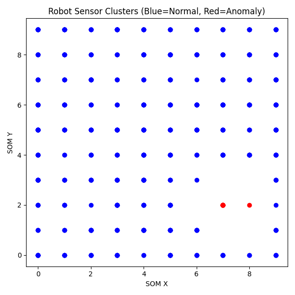
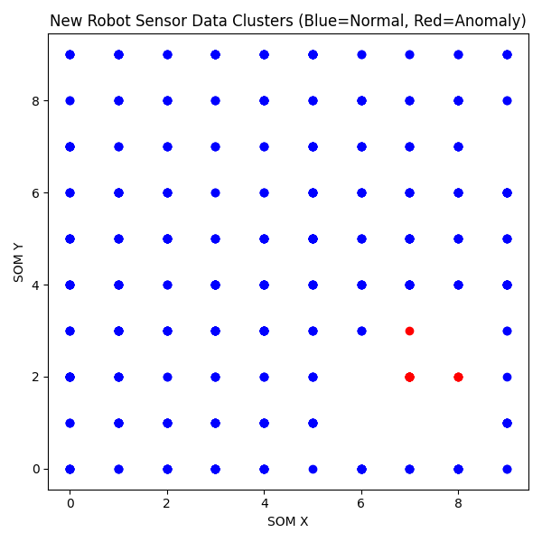

# Robot Sensor Anomaly Detection Using SOM

This project uses **Self-Organizing Maps (SOM)** to detect anomalies in robot sensor data.

## Features
- Simulate robot sensor data
- Train SOM model for clustering
- Detect anomalies
- Visualize results

## Screenshots

Cluster plot from training data:

Cluster plot using new data:

## Usage

1. Run `main.py` to simulate data and generate plots  
2. Run `use_saved_som.py` to use the saved SOM model (`som_model.pkl`)  

## License

MIT License